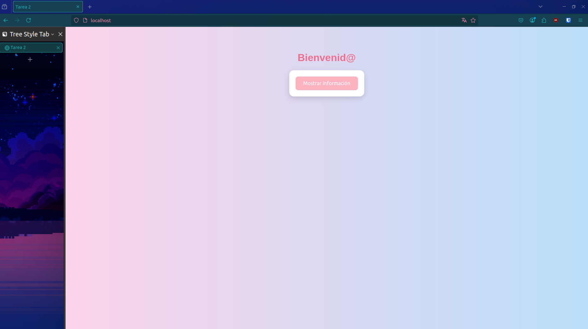

# TAREA 2

### Despliegue de Página Web Con Docker

## DOCKERFILE

El Dockerfile proporcionado crea una imagen Docker para una aplicación Node.js. Utiliza la imagen base oficial de Node.js versión 18, establece el directorio de trabajo en `/app`, copia los archivos `package.json` y `package-lock.json` al contenedor, así como el archivo `index.js` y el directorio `web`. Luego, ejecuta `npm install` para instalar las dependencias necesarias. Expone el puerto 80 para la aplicación y define el comando para iniciar la aplicación con `node index.js`.

```
FROM node:18

WORKDIR /app

COPY package*.json ./
COPY index.js ./
COPY web ./web

RUN npm install

EXPOSE 80

CMD ["node", "index.js"]
```

## IMAGEN Y CONTENEDOR


```
docker build -t mi-web-tarea2
```

El comando crea una nueva imagen Docker a partir del Dockerfile en el directorio actual. La opción `-t` etiqueta la imagen con el nombre `mi-web-tarea2`, lo que facilita su identificación y uso posterior.


```
docker run -name tarea2-container -p 80:80 mi-web-tarea2
```

Este comando ejecuta el contenedor y mapea el puerto 80 del contenedor al puerto 80 de la máquina host (`-p 80:80`).

## DESPLIEGUE

Este es la pagina Web que fue desplegada


Al presionar el boton se muestra los datos correspodientes


Se puede verificar que el contenedor esta activo y corriendo con el comando:

```
docker ps
```


